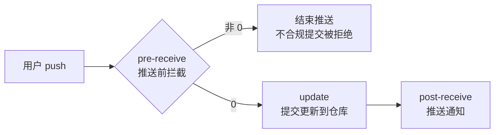

<p align="center">
  <strong style="font-size: 1.5rem;">@7dgroup/dsh-skill-7d-git-commit</strong>
</p>

<p align="center">
  
  
  
</p>

<p align="center">
  
</p>

<p align="center">
  <a href="README.md">English</a> | <strong>中文</strong>
</p>

# @7dgroup/dsh-skill-7d-git-commit

**作者：7DGroup**

一个 DSH（DeepSeek Harness）组合层插件包，通过 `ctx.skills` 注册 `7d-git-commit` 技能。在生成任何 `git commit` 提交信息前，自动按**7DGroup 项目提交规范**进行校验，规避 gitlab 服务端 `pre-receive` hook 拦截。零核心改动——安装即启用，移除 bundle 行即卸载。

---

## 项目信息

| 项目 | 值 |
|---|---|
| 作者 | 7DGroup |
| 版本 | 0.1.0-rc.3 |
| 运行环境 | Node `^22.19.0 || >=24.0.0` · pnpm 10+ · dsh CLI |
| Peer 依赖 | `@deepseek-ai/cordis` · `@deepseek-ai/dsh-skill` · `@deepseek-ai/dsh-invariants` |
| 技能名称 | `7d-git-commit` |
| 仓库地址 | [github.com/7dgroup-ai/dsh-skill-7d-git-commit](https://github.com/7dgroup-ai/dsh-skill-7d-git-commit) |
| 许可证 | MIT |

## 功能特性

- 在 `git commit` 执行前进行**客户端提交规范预判**。
- 支持 9 个固定中文类型标签：`【新增】`、`【修复】`、`【优化】`、`【调整】`、`【删除】`、`【文档】`、`【测试】`、`【回滚】`、`【合并】`。
- 校验标题长度、末尾标点、禁用字符/短语、动宾句式等规则。
- 正文格式校验：数字序号逐条罗列、每行 ≤70 字符。
- 支持 Merge commit 与紧急发版 `[skip-check]` 豁免。
- 内置事实来源 `references/git-commit-message.md`，按需加载不撑大提示词。
- 纯组合包挂载，不打 DSH 核心补丁。

## 项目结构

```
dsh-skill-7d-git-commit/
├── src/
│   ├── index.ts              # Cordis 插件：注册技能提供者
│   └── invariant.ts          # 包所有权不变量伴生插件
├── assets/7d-git-commit/
│   ├── SKILL.md              # 技能体：校验逻辑
│   └── references/
│       └── git-commit-message.md   # 7DGroup 提交规范事实来源
├── assets/images/
│   └── 7d-git-commit-cover.jpg     # README 封面图
├── tests/
│   └── skill-7d-git-commit.spec.ts
├── cordis.patch.yml          # 组合层补丁
├── tsdown.config.ts          # 自包含转译配置
├── package.json
└── README.md / README.zh.md
```

## 快速开始

前置条件：`dsh` CLI、Node `^22.19.0 || >=24.0.0`、pnpm 10+。

### 通过 dsh CLI 安装

```sh
dsh plugin --profile web add github:7dgroup-ai/dsh-skill-7d-git-commit
```

首次 git 安装时，pnpm 会拒绝运行构建脚本，需要把 pnpm 打印的确切包键写入该 profile 的 `pnpm-workspace.yaml` → `allowBuilds`，然后重新执行命令。

如需跳过构建授权，可使用预构建 tarball 或发布后的 npm 包：

```sh
dsh plugin --profile web add @7dgroup/dsh-skill-7d-git-commit
```

### 在 dsh 会话中安装（推荐）

最直接的方式——在任意 dsh 会话中直接告诉助手，它会替你执行安装。使用 GitHub 地址形式（npm 包名 `@7dgroup/dsh-skill-7d-git-commit` 需等发布到 npm 后才能使用）：

> 安装插件 github:7dgroup-ai/dsh-skill-7d-git-commit

助手会在会话内通过 Shell 执行对应的 `dsh plugin` 命令。git 安装时会遇到同样的 pnpm `allowBuilds` 门禁，助手会打印需要添加进 profile 的 pnpm 设置文件（`~/.dsh/profiles/<name>/pnpm-workspace.yaml`）的确切授权键；添加后让助手重试即可完成安装。

### 构建与测试

```sh
pnpm install
pnpm build   # tsdown；git 安装时也会以 prepare 钩子运行
pnpm test    # vitest
```

## 使用方式

安装后，在 dsh 会话中提到任意与提交相关的需求即可触发：

> 为当前改动生成一条 commit message。

技能会执行：

1. 分析改动内容。
2. 从 9 类标签中选择最匹配的类型。
3. 撰写标题：`【类型】` + 动宾短语（≤50 字符，无末尾标点）。
4. 复杂改动补充数字序号详情（每行 ≤70 字符）。
5. 按校验清单逐项检查，不合规则提示修正。

## 提交规范

完整规则见 `assets/7d-git-commit/references/git-commit-message.md`。

核心要求：

- 标题格式：`【类型】简短描述`
- 标题长度：去标签后 ≤50 字符
- 末尾禁止：`。` `，` `.` `,`
- 标题/正文禁用字符：`@ # $ % ^ & * ~`
- 禁用短语：待优化、TODO、FIXME、个人情绪等临时备注
- 正文每行 ≤70 字符，使用数字序号逐条罗列

## 与 GitLab 集成使用

本插件同时提供客户端 DSH skill 与服务端 GitLab hook，建议组合使用形成"客户端预判 + 服务端兜底"的双层校验。

- 客户端：`assets/7d-git-commit/SKILL.md` 在 `git commit` 前校验提交信息。
- 服务端：`docs/gitlab-integration/pre-receive` 在 `git push` 到达仓库前校验并告警/拦截。
- 规范来源：`assets/7d-git-commit/references/git-commit-message.md`，客户端与服务端共用同一套规则。

### 集成功能说明

#### 背景：为什么要做提交信息校验

每接收一份新版本代码，第一件事往往是查看 git log。如果提交记录杂乱无章、看不出每次提交做了什么，对他人 review 和后续维护都很痛苦。规范的提交记录（CHANGELOG）不仅有助于他人 review 代码，也能高效输出 Release Note，对版本管理至关重要。因此考虑用 GitLab 服务端 hook 对 git change log 做校验，拦截不符合规范的提交。

#### 设计原理：选择 pre-receive 阶段拦截

GitLab 服务端 hook 分为三种（对应 push 完成后服务端的处理流程）：

| Hook | 阶段 | 作用 |
|------|------|------|
| `pre-receive` | 推送前 | 用户 push 之后刚到 GitLab 服务器内，用于拦截用户的推送 |
| `update` | 更新中 | 提交更新到 GitLab 仓库内 |
| `post-receive` | 推送后 | 提交到 GitLab 成功之后，用于推送通知 |

处理流程示意：



在 `pre-receive`（推送前）阶段做提交信息校验：如果不符合规范，脚本直接以非 0 退出，该推送便不会进入 GitLab 仓库。

#### 工作原理

`pre-receive` 从标准输入读取本次推送的信息：`oldrev newrev refname`（旧 commit id、新 commit id、分支名）；再用 `git log` 取出提交者、提交日期与提交注释；最后用正则校验标题是否以约定前缀开头（参考文章示例：`fix|add|del|update|temp|test|revert|Merge`），不匹配则输出错误并 `exit 1` 拒绝推送。

#### 实践落地（参考文章的手动部署方式）

1. **找到仓库物理路径**：GitLab 自某版本起采用 hash 存储，需通过管理员账号获取仓库对应的物理路径，形如 `/srv/gitlab/data/git-data/repositories/@hashed/78/5f/785f3ec7...git`。
2. **创建 custom_hooks**：在仓库目录下新建 `custom_hooks` 目录，再创建 `pre-receive` 文件（shell 脚本）。
3. **赋予执行权限**：`chmod +x pre-receive`。
4. **本地 push 验证**：不符合规范的提交会推送失败，符合规范则正常推送。

> 本仓库 `docs/gitlab-integration/` 是上述方案的工程化实现：遍历 stdin 全部 ref（而非只读第一行）、warn/reject 双模式、规则外置到 `commit-rules.conf`、审计日志与钉钉日报，可直接用 `install-hooks.sh` 一键部署，见下文。

#### 踩坑

GitLab 不同版本自带的 git 版本不一致，相同命令的输出也可能不一致，需要特别注意。例如 `git log --no-merges --date-order -1` 在不同 git 版本下输出格式存在差异，脚本不要依赖未验证的命令输出。

> 参考文章：[GitLab 服务端 hook 拦截提交到仓库](https://zuozewei.blog.csdn.net/article/details/122124164)

### 部署服务端 hook

将 `docs/gitlab-integration/` 目录复制到 GitLab 服务器，然后执行：

```sh
# 单仓试点
sudo bash install-hooks.sh --pilot devops/7dgroup

# 试点验证通过后推广全局
sudo bash install-hooks.sh --global
```

### 规则同步

当本仓库中 `docs/gitlab-integration/commit-rules.conf` 变更后：

```sh
sudo bash scripts/sync-rules.sh --global --dry-run
sudo bash scripts/sync-rules.sh --global
```

### 观察期巡检与钉钉日报

```sh
# 生成 Markdown 日报
sudo bash scripts/audit-report.sh --markdown

# 推送钉钉机器人
export DINGTALK_WEBHOOK="https://oapi.dingtalk.com/robot/send?access_token=xxx"
sudo -E bash scripts/dingtalk-notify.sh
```

### 切换硬拦截

1. 完成 `docs/gitlab-integration/switch-to-reject-checklist.md`。
2. 将部署后的 `commit-rules.conf` 中 `MODE` 改为 `"reject"`。
3. 下次 push 立即生效。

完整部署 SOP 见 [`docs/gitlab-integration/deployment-guide.md`](./docs/gitlab-integration/deployment-guide.md)。

## 注意事项

1. 该提供方只贡献一个固定 skill，不提供运行时自定义。
2. `prepare` 构建不附带类型声明；dsh Loader 只加载运行时入口。
3. 构建只做转译（`dts: false`），没有 lint 或类型检查脚本——类型错误只能在编辑器/IDE 中暴露。
4. `docs/gitlab-integration/` 目录文件不进入 DSH 运行时包，请按需复制到 GitLab 服务器使用。

## 许可证

[MIT](LICENSE) · Copyright (c) 2026 7DGroup
