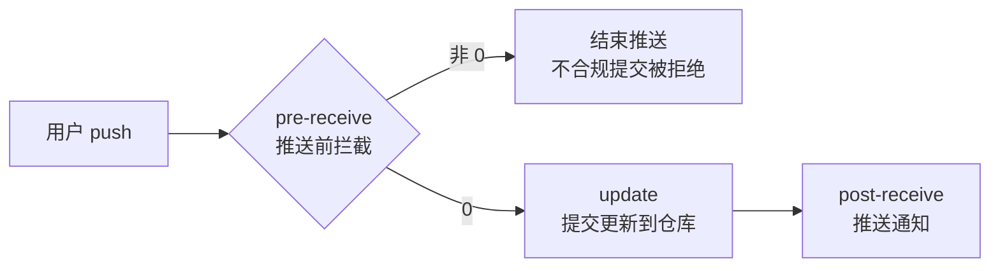

# GitLab 服务端提交校验：应用场景说明

> 本文是 `@7dgroup/dsh-skill-7d-git-commit` 插件「客户端预判 + 服务端兜底」双层校验体系的应用场景指南，帮助团队判断**什么时候该用、怎么用、哪些场景要小心**。
>
> 配套文档：部署 SOP 见 [`deployment-guide.md`](./deployment-guide.md)，硬拦截切换见 [`switch-to-reject-checklist.md`](./switch-to-reject-checklist.md)，规则配置见 [`commit-rules.conf`](./commit-rules.conf)。

---

## 一、背景与设计思路

每接收一份新版本代码，第一件事往往是查看 git log。如果提交记录杂乱无章、看不出每次提交做了什么，代码 review 与后续维护都会很痛苦；规范的提交记录（CHANGELOG）不仅有助于他人 review 代码，也能高效输出 Release Note，对版本管理至关重要。

GitLab 服务端 hook 分三种（用户 push 之后服务端的处理流程）：

| Hook | 阶段 | 作用 |
|------|------|------|
| `pre-receive` | 推送前 | 用户 push 之后刚到 GitLab 服务器内，用于拦截用户的推送 |
| `update` | 更新中 | 提交更新到 GitLab 仓库内 |
| `post-receive` | 推送后 | 提交到 GitLab 成功之后，用于推送通知 |



本方案在 **`pre-receive`（推送前）阶段**校验提交信息：不符合规范直接以非 0 退出，该推送便不会进入 GitLab 仓库，从源头保证 git change log 的规范性与可读性。

> 参考文章：[GitLab 服务端 hook 拦截提交到仓库](https://zuozewei.blog.csdn.net/article/details/122124164)

---

## 二、典型应用场景

### 场景 1：团队提交规范强制落地（核心场景）

**适用对象**：多人协作的 GitLab 项目，尤其是外包团队、跨部门协作、新人较多的团队。

**痛点**：约定式规范靠自觉执行，总有"漏网之鱼"，git log 混乱影响 review 与 Release Note 输出。

**落地方式**：客户端 DSH skill 预判 + 服务端 `pre-receive` 兜底拦截，形成双层校验：

1. 开发本地：`7d-git-commit` skill 在 `git commit` 前按规范校验并提示修正；
2. 服务端：`docs/gitlab-integration/pre-receive` 在 `git push` 到达仓库前复核，不合规告警/拦截。

**效果**：违规提交在进入仓库前被拦住，团队长期保持规范的提交记录。

### 场景 2：渐进式推广（单仓试点 → 全局推广，观察期 → 硬拦截）

**适用对象**：规范推广阻力大、团队习惯差异大的组织。

**分阶段落地**：

1. **单仓试点**：`sudo bash install-hooks.sh --pilot devops/7dgroup`，先在一个仓库验证规则与流程；
2. **观察期**（`MODE="warn"`）：只告警不拦截，违规写入 `/var/log/gitlab/commit-check.log`，通过 `scripts/audit-report.sh` 观察违规趋势；
3. **全局推广**：试点 1~2 周无问题后 `sudo bash install-hooks.sh --global`（写 `gitlab.rb` 的 `custom_hooks_dir` 并 `gitlab-ctl reconfigure`）；
4. **切换硬拦截**：完成 [`switch-to-reject-checklist.md`](./switch-to-reject-checklist.md) 后，将 `MODE` 改为 `"reject"`，下次 push 立即生效。

**回滚路径**：软回滚（`MODE` 改回 `"warn"`）/ 硬回滚（`--uninstall-pilot` / `--uninstall-global`），见部署指南"回滚"一节。

### 场景 3：紧急发版 / 热修复旁路（`[skip-check]`）

**适用对象**：线上紧急缺陷修复、生产环境 hotfix 等需要快速推送、来不及按规范改写提交信息的场景。

**落地方式**：提交信息（标题或正文）包含 `SKIP_KEYWORD="[skip-check]"` 即放行校验，但会写入一行 `BYPASS` 审计日志留痕，防止滥用。

**注意**：旁路能力务必通过 `commit-rules.conf` 明确告知团队"仅限紧急发版"，且日志中可审计谁在什么时间旁路了哪次提交。

### 场景 4：Merge commit 豁免（`ALLOW_MERGE`）

**适用对象**：使用 GitLab Merge Request / `git merge` 合并分支的团队。

**背景**：Merge commit 的标题由 Git 自动生成（如 `Merge branch 'feat-xxx' into main`），人工无法按 `【类型】` 格式改写，也不应被拦截。

**落地方式**：`ALLOW_MERGE=true` 时，标题以 `Merge ` 开头的提交自动豁免，同样记 `BYPASS` 日志。

### 场景 5：多仓库 / 多团队统一治理（全局 hook）

**适用对象**：公司级 GitLab 实例下有多个项目/团队，希望一套规则全局生效。

**落地方式**：`install-hooks.sh --global` 将 hook 部署到 Gitaly 的全局 `custom_hooks_dir`（如 `/var/opt/gitlab/gitaly/custom_hooks/pre-receive.d/`），所有仓库共享同一份 `commit-rules.conf`；规则变更通过 `scripts/sync-rules.sh --global` 一键同步。

**注意**：全局部署前必须确认 `gitlab.rb` 中 `gitaly['configuration'][:hooks][:custom_hooks_dir]` 配置正确并执行 `gitlab-ctl reconfigure`，否则 hook 不生效（见部署指南"注意事项"）。

### 场景 6：规范演进与规则同步

**适用对象**：提交规范会随团队发展阶段调整（新增/删除类型标签、调整长度限制、增减禁用词）。

**落地方式**：校验规则全部外置到 `commit-rules.conf`，`pre-receive` 脚本不含任何规则；改配置即时生效，无需动脚本、无需重启 Gitaly。多台服务器/多个部署副本之间用 `scripts/sync-rules.sh` 保持规则一致。

### 场景 7：违规度量与钉钉日报（数据驱动整改）

**适用对象**：需要量化规范执行情况、向管理层汇报、督促高频违规者整改的团队。

**落地方式**：

```sh
# 生成观察期 Markdown 日报（按仓库/用户统计违规 TOP）
sudo bash scripts/audit-report.sh --markdown

# 推送钉钉机器人
export DINGTALK_WEBHOOK="https://oapi.dingtalk.com/robot/send?access_token=xxx"
sudo -E bash scripts/dingtalk-notify.sh
```

日报数据也是 [`switch-to-reject-checklist.md`](./switch-to-reject-checklist.md) 中"违规趋势是否下降并低于阈值"的判定依据。

### 场景 8：存量仓库 / 历史提交治理

**适用对象**：已有大量历史提交不合规的存量仓库。

**注意**：`pre-receive` 只校验**本次推送引入的新提交**（`git rev-list oldrev..newrev`，新分支用 `--not --all`），不会翻旧账；但若对历史分支做 force push 重写，新增到远端的所有提交都会过检。

**建议**：存量仓库先以 `warn` 观察期上线，配合日报督促整改，待违规收敛后再切 `reject`，避免第一天就大量拦截推送引发团队反弹。

### 场景 9：本地规则自测（不上服务器也能验证规则）

**适用对象**：开发/运维在修改 `commit-rules.conf` 后，想先本地验证再上 GitLab。

**落地方式**：

```sh
cd docs/gitlab-integration/scripts
bash test-hook-locally.sh -m "【新增】用户模块新增手机号登录接口"   # 期望 CHECK
bash test-hook-locally.sh -m "bad commit no tag"                   # 期望 WARN/REJECT
```

---

## 三、适用边界

### ✅ 适合使用

| 条件 | 说明 |
|------|------|
| 多人协作的 GitLab 仓库 | 规范执行难统一，需要服务端兜底 |
| 团队重视代码 review / Release Note | 规范的提交记录直接提升 review 与发布效率 |
| 有 GitLab 服务器运维权限 | 能部署全局 `custom_hooks_dir` 或单仓 `custom_hooks` |
| 可接受渐进式上线 | 观察期 → 硬拦截的分阶段节奏 |

### ⚠️ 需要谨慎 / 不适合

| 场景 | 原因与建议 |
|------|-----------|
| 无 GitLab 服务器权限 | 无法部署服务端 hook，只能使用客户端 DSH skill 预判 |
| 单人维护的个人仓库 | 服务端拦截收益低，客户端校验足够 |
| 规则尚未与团队达成共识 | 硬拦截会引发抵触，务必先 `warn` 观察 |
| GitLab 版本过旧 | 老版本 hook 目录约定（`custom_hooks` vs `pre-receive.d`）与 `GL-HOOK-ERR` 回显行为不同，需按版本验证（见踩坑） |
| 大量自动化 bot 提交 | bot 生成的提交信息若不遵守规范会被拦截，需评估 `SKIP_KEYWORD` 或规则豁免 |

---

## 四、踩坑与注意事项

1. **git 版本差异**：GitLab 不同版本自带的 git 版本不一致，相同命令的输出也可能不一致（如 `git log --no-merges --date-order -1`），hook 脚本不要依赖未验证的命令输出。
2. **hook 目录约定**：单仓试点用 `<repo>.git/custom_hooks/pre-receive` 文件；全局推广用 `custom_hooks_dir` 下的 `pre-receive.d/` 目录，两者语法与生效方式不同，部署前按 GitLab 版本核对。
3. **文件属主与权限**：`pre-receive` 以 `git` 用户身份执行，部署后必须 `chown git:git` 且 `chmod +x`；日志文件需 `git` 用户可写，否则 hook 静默跳过日志。
4. **多 ref 推送**：`pre-receive` 必须用 `while read` 遍历 stdin 的全部 ref（旧脚本常见只读第一行的错误），本仓库脚本已处理。
5. **中文长度计数**：`wc -m` 依赖 locale，脚本依次尝试 `C.UTF-8` / `en_US.UTF-8` / `zh_CN.UTF-8`，服务器需安装对应 locale。
6. **规则即时生效**：修改 `commit-rules.conf` 后下次 push 即生效，无需重启 Gitaly 或 `gitlab-ctl reconfigure`（全局目录配置除外）。

---

## 五、常见问题（FAQ）

| 问题 | 排查方向 |
|------|---------|
| hook 没有生效 | 检查部署路径、`chown git:git`、`chmod +x`、全局配置是否 reconfigure |
| push 被拒但不知道怎么改 | 提示会给出规范格式；如为紧急发版可加 `[skip-check]` |
| 观察期误报过多 | 调整 `commit-rules.conf`（正则、长度、禁用词），本地用 `test-hook-locally.sh` 先验证 |
| 想让某类提交豁免 | 使用 `ALLOW_MERGE`（Merge commit）或 `SKIP_KEYWORD`（紧急旁路） |
| 如何证明规范有效 | 用 `audit-report.sh` 出日报，观察 WARN 趋势下降后按清单切 `reject` |
